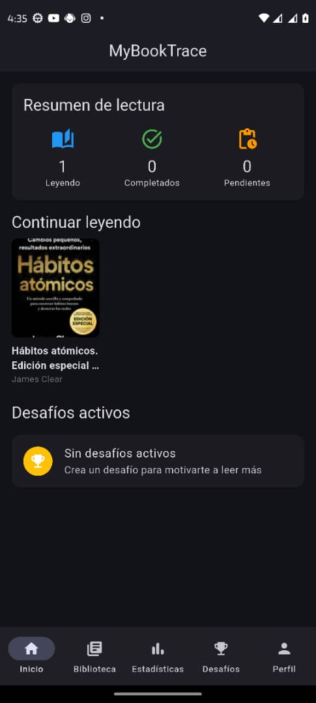
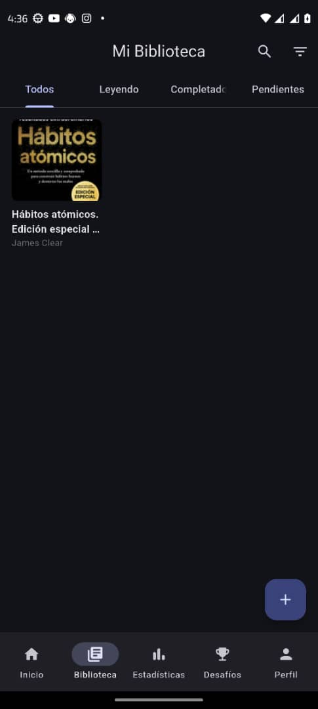
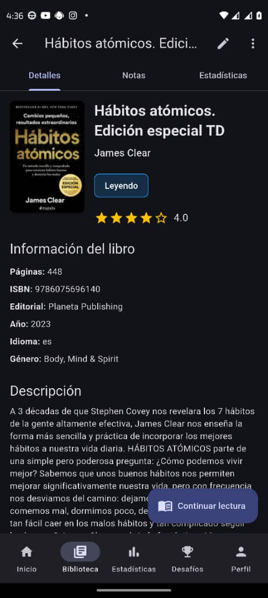
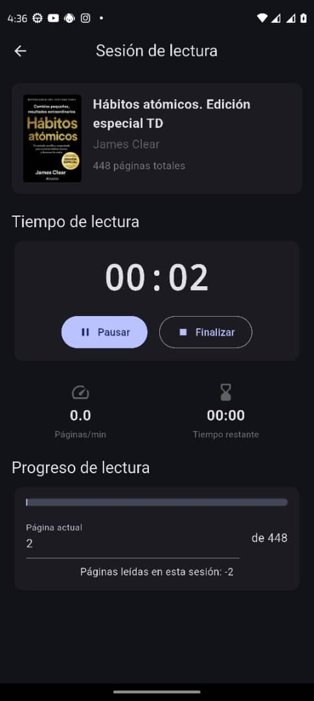
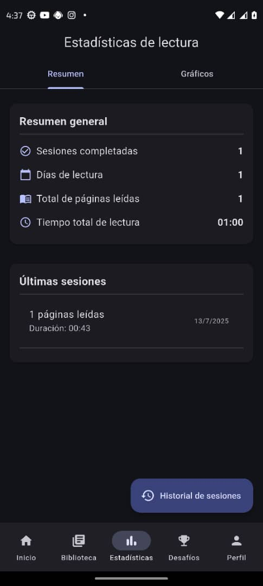

<p align="center">
  
</p>

<h1 align="center">My Book Trace</h1>

<p align="center">
  <b>Tu compañero digital para la lectura</b>
</p>


## 📖 Descripción

MyBookTrace es una aplicación móvil desarrollada con Flutter para rastrear y gestionar tus hábitos de lectura. La aplicación permite a los usuarios registrar sus libros, crear sesiones de lectura, establecer metas de lectura, y visualizar su progreso a través de estadísticas detalladas. Con MyBookTrace, nunca perderás el hilo de tus lecturas ni olvidarás cuánto has avanzado en cada libro.

## 📸 Capturas de Pantalla

<div align="center">
  <div style="display: flex; flex-wrap: wrap; justify-content: space-between;">
    
    
    
    
    
  </div>
</div>

## 🌟 Funcionalidades

### Gestión de Libros

- **Biblioteca Personal**: Crea y mantiene una biblioteca personal de los libros que estás leyendo o planeas leer.
- **Añadir Libros**: Agrega nuevos libros manualmente o escanea su código de barras para importar detalles automáticamente.
- **Detalles Completos**: Almacena título, autor, género, ISBN, portada, sinopsis, y calificación personal para cada libro.
- **Categorización**: Organiza tus libros por género, estado de lectura (no iniciado, en progreso, completado), o calificación.

### Sesiones de Lectura

- **Registro de Sesiones**: Registra el tiempo que dedicas a cada libro y las páginas que avanzas.
- **Sesiones Activas**: Mantiene un temporizador durante las sesiones de lectura para realizar un seguimiento preciso.
- **Historial de Lectura**: Visualiza tu historial completo de sesiones para cada libro.
- **Notas y Reflexiones**: Añade notas o pensamientos sobre lo leído durante cada sesión.

### Estadísticas y Análisis

- **Progreso Visual**: Visualiza tu progreso de lectura a través de gráficos e indicadores de progreso.
- **Estadísticas Detalladas**: Analiza tu velocidad de lectura, tiempo total de lectura, y otros métricas clave.
- **Tendencias Temporales**: Observa cómo evolucionan tus hábitos de lectura a lo largo del tiempo.
- **Resumen por Libro**: Accede a estadísticas específicas para cada libro en tu biblioteca.

### Desafíos de Lectura

- **Crear Desafíos**: Establece metas personales como "Leer 12 libros este año" o "Dedicar 30 minutos diarios a la lectura".
- **Seguimiento Automático**: La aplicación rastrea automáticamente tu progreso hacia las metas establecidas.
- **Notificaciones**: Recibe recordatorios para mantener tus hábitos de lectura.

### Perfil de Usuario

- **Preferencias Personales**: Configura tu perfil con tus preferencias de lectura y géneros favoritos.
- **Estadísticas Globales**: Visualiza estadísticas generales sobre todos tus hábitos de lectura.
- **Personalización**: Adapta la aplicación a tus necesidades específicas.

## 🛠️ Arquitectura y Diseño Técnico

MyBookTrace sigue una arquitectura limpia y organizada que separa claramente las responsabilidades:

### Estructura del Proyecto

La estructura principal del código se encuentra dentro del directorio `lib/` y se organiza de la siguiente manera:

- **`main.dart`**: Punto de entrada de la aplicación. Inicializa providers y configuraciones globales.

- **`/config`**: Configuraciones globales para la aplicación.
  - Definiciones de temas (colores, tipografía, estilos)
  - Configuración de rutas
  - Constantes de configuración general

- **`/constants`**: Almacena valores constantes utilizados en toda la aplicación.
  - Strings de UI
  - Claves de API
  - Constantes de negocio

- **`/models`**: Define las clases de modelo de datos que representan entidades del dominio.
  - `Book`: Representa un libro con sus detalles
  - `ReadingSession`: Almacena información sobre una sesión de lectura
  - `Challenge`: Define un desafío de lectura
  - `User`: Información del usuario

- **`/providers`**: Gestión de estado usando el patrón Provider.
  - `BookProvider`: Gestiona el estado de los libros
  - `ReadingSessionProvider`: Controla las sesiones de lectura
  - `ChallengeProvider`: Administra los desafíos de lectura

- **`/repositories`**: Contiene la lógica de acceso a datos.
  - Implementa métodos CRUD para cada entidad
  - Gestiona la persistencia de datos usando SQLite
  - Maneja cache y optimizaciones de rendimiento

- **`/screens`**: Las diferentes pantallas o vistas de la aplicación.
  - `/book_screens`: Pantallas relacionadas con libros
  - `/reading_screens`: Pantallas de sesiones y estadísticas de lectura
  - `/challenges`: Pantallas de desafíos de lectura
  - `/profile`: Pantallas de perfil de usuario

- **`/services`**: Implementa la lógica de negocio de la aplicación.
  - Servicios de autenticación
  - Servicios de análisis de datos y estadísticas
  - Integraciones con APIs externas

- **`/utils`**: Funciones y clases de utilidad reutilizables.
  - Formateadores de fecha y texto
  - Validadores de entrada
  - Helpers de UI

- **`/widgets`**: Widgets reutilizables para mantener consistencia visual.
  - Botones personalizados
  - Tarjetas de información
  - Diálogos y componentes de UI comunes

### Patrones de Diseño Implementados

- **Repository Pattern**: Separa la lógica de acceso a datos del resto de la aplicación.
- **Provider Pattern**: Implementa gestión de estado reactiva y eficiente.
- **Singleton**: Utilizado para servicios que necesitan una única instancia global.
- **Factory**: Empleado en la creación de objetos complejos.

## 📚 Librerías Principales

El proyecto utiliza una selección de librerías de alta calidad:

- **`go_router`**: Sistema de navegación declarativa y robusta para manejar rutas complejas y deep linking.

- **`provider`**: Gestión de estado eficiente con bajo acoplamiento entre widgets y lógica de negocio.

- **`sqflite`**: Acceso a base de datos SQLite para almacenamiento persistente de libros, sesiones de lectura y desafíos.

- **`shared_preferences`**: Almacenamiento de datos simples y preferencias del usuario.

- **`fl_chart`**: Creación de gráficos interactivos para visualizar estadísticas de lectura.

- **`uuid`**: Generación de identificadores únicos para registros en base de datos.

- **`path`**: Manipulación de rutas del sistema de archivos, usado principalmente para localizar la base de datos.

## 👤 Equipo de Desarrollo

Desarrollado por Reny como proyecto personal para mejorar el seguimiento de hábitos de lectura.

## 📀 Base de Datos

La aplicación utiliza SQLite para el almacenamiento local de datos. El esquema de la base de datos incluye las siguientes tablas principales:

- **Books**: Almacena información detallada sobre cada libro.
- **ReadingSessions**: Registra cada sesión de lectura con su duración, páginas leídas, y notas.
- **Challenges**: Guarda los desafíos de lectura establecidos por el usuario.
- **UserPreferences**: Almacena las preferencias y configuraciones del usuario.

## 💾 Instalación y Configuración

1. Asegúrate de tener Flutter instalado (versión 3.x o superior)
2. Clona este repositorio
3. Ejecuta `flutter pub get` para instalar las dependencias
4. Ejecuta `flutter run` para iniciar la aplicación

```bash
git clone https://github.com/usuario/my_book_trace.git
cd my_book_trace
flutter pub get
flutter run
```

## 💬 Contribuciones

Las contribuciones son bienvenidas. Para cambios importantes, por favor abre primero un issue para discutir qué te gustaría cambiar.
